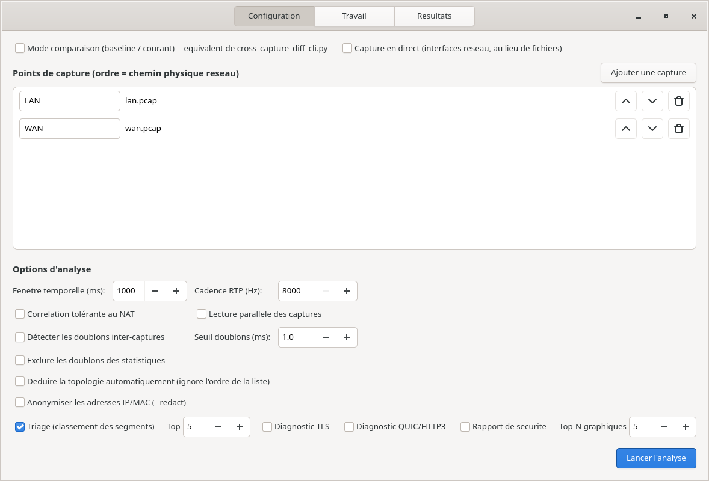
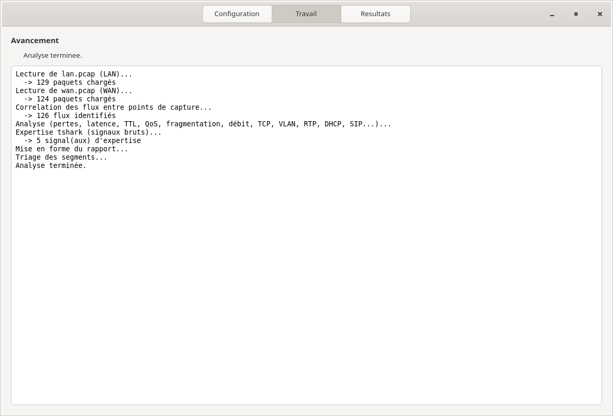
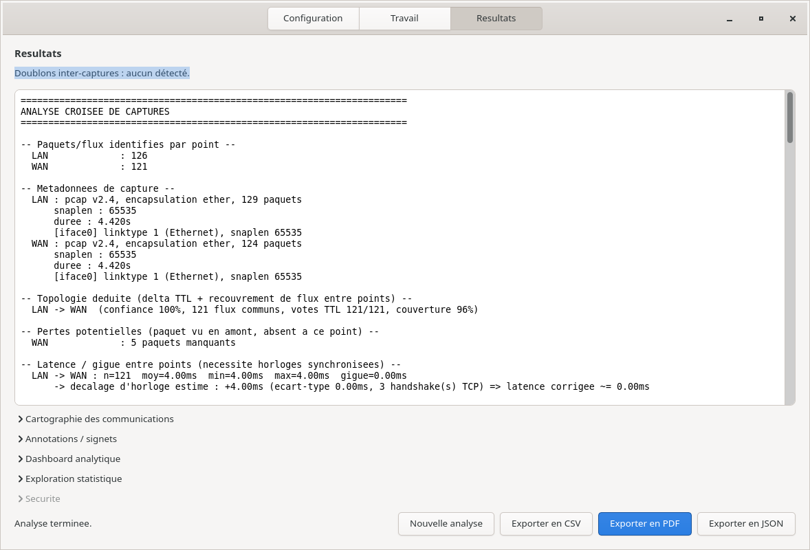
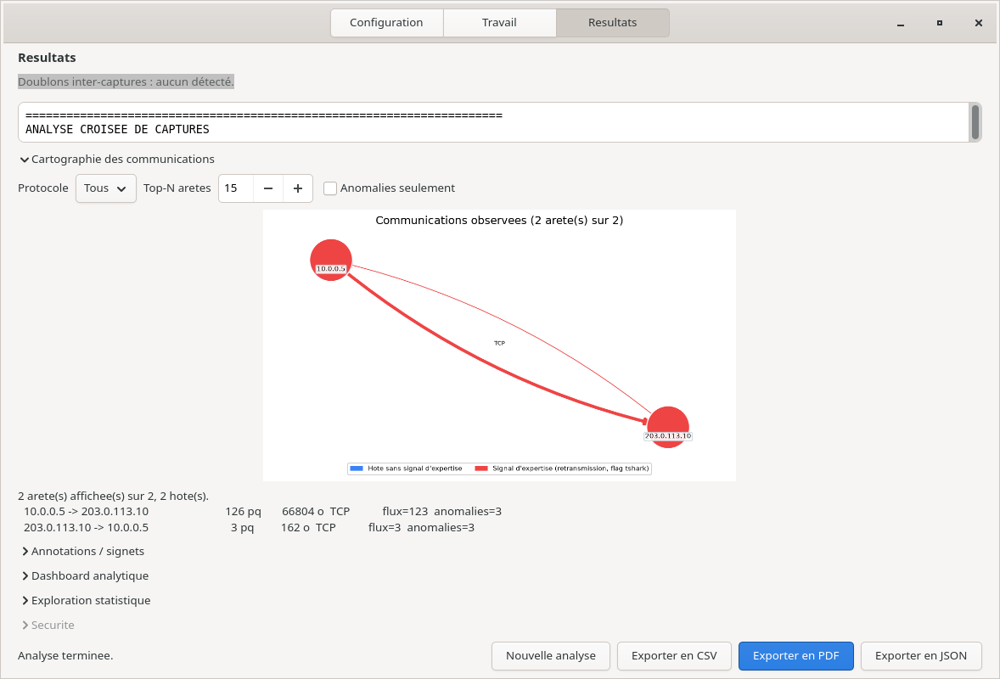

# Interface graphique

L'interface graphique propose les mêmes analyses que la ligne de commande,
sans commande à écrire. Elle se lance avec :

```bash
netcross-gui                          # paquet installé
cd src && python3 -m netcross_gtk4.app  # depuis les sources
```

Elle comporte trois onglets : **Configuration**, **Travail** et
**Résultats**. Les captures d'écran ci-dessous ont été prises avec les
captures d'exemple de [Première analyse](premiere-analyse.md).

## Configuration



1. **Ajouter une capture** ouvre un sélecteur de fichiers. Répétez
   l'opération pour chaque point.
2. Renommez chaque point dans le champ de gauche (`LAN`, `WAN`...). Deux
   lignes de même nom forment un seul point : ce sont les fichiers
   successifs d'une capture en rotation, lus dans l'ordre de la liste.
3. **Rangez les points dans l'ordre du chemin réseau** avec les flèches,
   du plus proche de la source au plus éloigné. Contrairement à la ligne
   de commande, l'interface utilise cet ordre tel quel par défaut. Si vous
   ne le connaissez pas, cochez « Déduire la topologie automatiquement » :
   Netcross le retrouve seul, comme en ligne de commande sans `--order`.
4. Choisissez les options, puis cliquez sur **Lancer l'analyse**.

Une seule capture suffit. Le rapport omet alors les sections qui comparent
des points entre eux (topologie, pertes, latence, sauts de routeur) : il
l'indique par une ligne « Capture unique : sections multi-points omises ».
Avec un pcapng pris sur plusieurs interfaces, cochez « Séparer les
interfaces d'un pcapng » : chaque interface devient un point, et l'analyse
croisée se fait entre elles (voir [Préparer les captures](preparer-captures.md)).

Options principales :

| Case ou champ | Effet | Équivalent en ligne de commande |
|---|---|---|
| Triage (classement des segments) et « Top » | Classe les segments à regarder en premier | `--triage`, `--triage-top-n` |
| Corrélation tolérante au NAT | Nécessaire si un NAT est traversé entre deux points | `--nat-tolerant` |
| Lecture parallèle des captures | Plus rapide sur une machine multicœur | `--parallel` |
| Détecter / Exclure les doublons inter-captures | Repère les paquets vus deux fois (miroir mal configuré) | `--detect-duplicates`, `--exclude-duplicates` |
| Anonymiser les adresses IP/MAC | Rapport partageable sans adresses réelles | `--redact` |
| Diagnostic TLS, Diagnostic QUIC/HTTP3 | Certificats, négociations, QUIC | `--tls`, `--quic` |
| Rapport de sécurité | Vulnérabilités et tentatives d'attaque | `--security-report` |
| Notifier si, webhook, Slack, courriel, Détail complet | Envoie un résumé du rapport de sécurité quand son pire constat atteint le seuil choisi (voir [Notifications](../notifications.md)). Nécessite « Rapport de sécurité » ; une URL invalide bloque le lancement. Le résultat de chaque canal s'affiche au journal | `--notify-on`, `--notify-webhook`, `--notify-slack`, `--notify-email`, `--notify-detail` |
| Postes à comparer, Référence | Compare des postes entre eux dans la même analyse : un groupe par poste, `NOM=IP1[,IP2...]`, séparés par « ; » (au moins deux), comparé au poste de référence (le premier par défaut). Résultat dans le rapport, synthèse et export CSV sur la page Résultats. Indisponible avec l'anonymisation | `--client-group`, `--client-reference`, `--client-diff-csv` |
| Fenêtre temporelle (ms) | Précision des mesures de débit (réduire pour les micro-rafales) | `--bucket-ms` |
| Séparer les interfaces d'un pcapng | Un fichier capturé sur plusieurs interfaces devient un point par interface, nommé `NOM:INTERFACE` | `--split-interfaces` |
| Moteur de règles | Évalue chaque règle du catalogue déclaratif ; section « MOTEUR DE REGLES DECLARATIF » du rapport | `--rule-engine` |
| Section expertise | Objets de session détaillés (flux, segments, diagnostics, preuves) à la fin du rapport | `--expert-section` |
| Qualité média | Relit les fichiers : voix et vidéo RTP, documents transportés, sans rien écrire (l'extraction vers un dossier est sur la page Résultats) | `--media-quality` |
| Statistiques tshark | `tshark -z` sur chaque fichier (conversations, endpoints, hiérarchie de protocoles, IO), export JSON sur la page Résultats | `--tshark-stats` |
| Chronologie des flux, Fenêtre (s) | Chronologie de chaque conversation, point par point, par fenêtres de N secondes ; export JSON sur la page Résultats | `--flow-timeline`, `--flow-timeline-window` |

Réglages fins, à ne modifier qu'en connaissance de cause :

| Champ ou bouton | Effet | Équivalent en ligne de commande |
|---|---|---|
| Fenêtre NAT (ms) | Écart maximal entre deux observations d'un même paquet traduit par un NAT. Actif seulement avec la corrélation tolérante au NAT (défaut : 200 ms) | `--nat-window-ms` |
| Coupure silencieuse (s) | Silence au-delà duquel une connexion inactive est signalée comme coupée par un NAT ou un pare-feu. 0 = défaut (60 s) | `--idle-timeout-seconds` |
| Table des noms... / Retirer | Charge un fichier JSON ou YAML de noms lisibles des hôtes (`srv-ad`, `imprimante-rdc`...), repris dans les exports CSV et JSON | `--names` |
| Seuil doublons (ms) | Écart maximal pour considérer deux paquets identiques comme doublons | `--duplicate-threshold-ms` |

En haut de l'onglet, deux cases changent de mode :

- **Mode comparaison** : deux listes de captures, Baseline et Courant,
  pour comparer deux situations. Ce mode a ses propres cases : seuils de
  pertes et de latence, Diagnostic TLS/QUIC et « Triage des écarts »
  (voir [Comparer deux situations](comparer.md)) ;
- **Capture en direct** : un nom, une interface réseau et un filtre BPF
  facultatif par point, au lieu de fichiers. Démarrage et arrêt manuels,
  ou durée maximale. Demande les droits de capture (voir
  [Installation](installation.md)).
  Deux options propres à ce mode : « Rotation de capture » (enregistre
  aussi la capture brute en fichiers tournants) et « Rapport HTML en
  continu ». Ce dernier publie pendant la capture une page `index.html`
  rafraîchie toutes les N secondes (débit, protocoles, hôtes, état de
  chaque point) dans le répertoire choisi, ou dans un répertoire temporaire
  indiqué au journal. Avec « Servir la page », elle est aussi servie sur
  `http://127.0.0.1:PORT/` (port 0 : port libre, indiqué au journal).
  Équivalent de `--live-report`, `--live-report-interval` et
  `--live-report-serve`.

Les deux cases se combinent : **Mode comparaison** et **Capture en
direct** cochées ensemble comparent un baseline enregistré (liste
Baseline) avec un courant capturé en direct (panneau live, qui remplace la
liste Courant). La comparaison démarre à l'arrêt de la capture (bouton ou
durée maximale), avec les seuils et le triage du mode comparaison.
Diagnostic TLS/QUIC, rotation de capture et rapport en continu ne sont
pas disponibles dans cette combinaison. Équivalent de `--live-current` et
`--live-duration` de `cross_capture_diff_cli.py`.

Ces deux modes ne se combinent pas entre eux.

## Travail



Le journal suit chaque étape en temps réel : lecture de chaque fichier
avec son nombre de paquets, corrélation, analyse, mise en forme. Vérifiez
que chaque point a bien chargé des paquets.

## Résultats



La zone principale affiche le même rapport que la ligne de commande
(voir [Lire le rapport](lire-le-rapport.md)). En bas, **Exporter en PDF**,
**Exporter en CSV** et **Exporter en JSON** produisent les mêmes fichiers
que `--pdf-report`, `--detail-csv` et `--json-report`, et
**Nouvelle analyse** revient à la configuration.

Sous le rapport, plusieurs sections se déplient :

- **Cartographie des communications** : qui parle à qui. Un rond par hôte
  (taille proportionnelle au volume), une flèche par sens. **En rouge**, les
  hôtes et échanges qui portent au moins un signal d'anomalie
  (retransmission, alerte tshark). Filtres par protocole, nombre d'échanges
  affichés et « Anomalies seulement ». Deux flèches par conversation TCP
  permettent de voir qu'un sens passe et que l'autre ne répond pas.

  

- **Annotations / signets** : une étiquette et un commentaire sur un
  numéro de trame (celui qu'affiche Wireshark), pour un point donné.
  Chaque annotation est enregistrée à côté de la capture, dans
  `<capture>.annotations.json`, et retrouvée à la prochaine analyse des
  mêmes fichiers. Clic droit pour ajouter ou supprimer.
- **Dashboard analytique** et **Exploration statistique** : vues
  interactives par segment, flux, hôte et protocole, avec tri et
  regroupement.
- **Recherche forensic** : si la case « Index de recherche forensic »
  était cochée, retrouve paquets et flux par texte libre, adresse IP,
  point, protocole, port ou champ décodé (SNI, URI, statut HTTP, Call-ID
  SIP, nom DNS, méthode, type de contenu, message), seuls ou combinés. Au
  moins un critère est demandé ; les 500 premiers résultats sont affichés,
  « Exporter JSON... » écrit tous les résultats avec la requête, dans le
  même format que `--forensic-search`. Cliquer un résultat affiche sa trame
  et le filtre Wireshark correspondant (`frame.number == N`) ; « Annoter la
  trame » pré-remplit le panneau « Annotations / signets », « Ouvrir dans
  Wireshark » ouvre la capture du point positionnée sur la trame
  (`wireshark -r FICHIER -g N`, si Wireshark est installé). Disponible après une analyse de
  fichiers ou une capture en direct, pas après une comparaison.
- **Contenus (extraction)** : relit les fichiers de l'analyse pour en
  extraire la voix et la vidéo transportées en RTP et les documents
  (HTTP, SMB, courriel, TFTP, FTP), vers un dossier **vide** choisi par
  « Extraire vers un dossier... ». Fichiers lisibles par vous seul, avec un
  `manifest.json` (empreintes SHA-256, origine, note de dégradation) et un
  `LISEZ-MOI.txt`. Lisez le rappel d'usage affiché : ce sont des
  correspondances et des données personnelles. Indisponible après une
  analyse anonymisée, une capture en direct ou une comparaison.
  Équivalent de `--extract-contents` et `--extract-kinds`.
- **Comparaison de postes** : si des postes ont été renseignés, la
  référence, les postes comparés et le nombre d'écarts, avec « Exporter
  CSV » (même fichier que `--client-diff-csv`).
- **NetFlow v5 (résumé d'exports)** : indépendant de l'analyse en cours.
  « Ajouter des exports... » (datagrammes NetFlow v5 concaténés, un fichier
  par exportateur, étiqueté par le nom du fichier), « Top », puis
  « Résumer » : volumes, protocoles, principaux émetteurs, conversations et
  ports, comme `--netflow` ; « Exporter JSON... » écrit le même fichier que
  `--netflow ... --json-report`. Les flux agrégés ne se corrèlent pas entre
  points de capture : ils ne sont pas mêlés à l'analyse.
- **Expertise (exports JSON)** : si « Chronologie des flux » ou
  « Statistiques tshark » étaient cochées, leur résumé et un bouton
  d'export chacun, même fichier que `--flow-timeline` et `--tshark-stats`.
  Les trois autres sections d'expertise sont dans le rapport texte.
- **Sécurité** : le rapport de sécurité, si la case correspondante était
  cochée, avec export HTML et JSON.

Après une comparaison ou une capture en direct, certaines sections sont
grisées : elles ont besoin des fichiers de capture d'une analyse simple.

!!! warning "Grosses captures"
    Le **Dashboard analytique** affiche une ligne par flux, sans limite.
    Sur une capture volumineuse, le déplier peut rendre la fenêtre très
    lente ou dépasser la hauteur de l'écran. Préférez alors
    l'**Exploration statistique** (Top-N réglable) ou l'export CSV.
    Le défaut est suivi dans le dépôt.

## Ce que l'interface ne fait pas

Certaines fonctions restent réservées à la ligne de commande : fusion,
découpage, conversion et rejeu de captures, plugins,
module IA, historique des analyses, base CVE complète (`--cve-db`),
export SIEM. Voir `--help` et les pages de la section Analyses.
